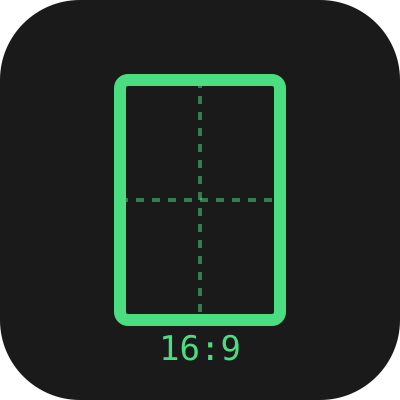

# Aspect Ratio Size Picker

A single, focused ComfyUI node for picking **text-to-image dimensions** without fiddling with manual width/height fields or chaining resize + rotate nodes.

Category: `EternalShade3D` → `Aspect Ratio Size Picker`



## Why

Most size-picking nodes either force you into megapixel math or are buried inside image-resize pipelines. This node does exactly one thing: pick a target canvas size for an **Empty Latent Image** node from three intuitive controls — and it tells you, in plain text, what you just selected.

## Controls

| Control | Type | Notes |
| --- | --- | --- |
| **Aspect Ratio** | Dropdown | `1:1 (Square)`, `4:3 (Standard)`, `3:2 (Classic 35mm Film)`, `5:4 (Large Format)`, `16:9 (Widescreen)`, `16:10 (Widescreen)` |
| **Long Edge** | Slider (INT) | 64–8192, step 8. Always maps to the larger dimension. |
| **Invert** | Toggle | Swaps the ratio (e.g. `4:3` → `3:4`, `16:9` → `9:16`). |

## Outputs

- `width` (INT)
- `height` (INT)
- `info` (STRING) — a live text preview so you can **see** what the node resolved:

```
=== PORTRAIT ===
16:9  ->  INVERTED  ->  9:16
Size: 1080 x 1920
Long edge 1920 = Full HD long edge / YouTube 1080p
Common long edges: 720, 1080, 1200, 1280, 1440, 1920, 2048, 2160, 2560, 3508, 3840, 4096, 5120, 7680
```

- The **`=== PORTRAIT / LANDSCAPE / SQUARE ===`** line is a semi-title so you immediately know the orientation.
- The **inverted preview** shows the original ratio → flipped ratio when `Invert` is on.
- The **Common long edges** line is a reminder of standard photography / video / social sizes.

Both `width` and `height` are snapped to a multiple of 8 for ComfyUI latent alignment.

## Example

```
Aspect Ratio Size Picker ──width──▶ Empty Latent Image
                       └─height─┘
                       └─info────▶ (preview text, optional)
```

Wire `width` and `height` straight into an **Empty Latent Image** node's `width`/`height` inputs.

## Common long-edge reference

| Long edge | Used for |
| --- | --- |
| 720 | HD 720p |
| 1080 | Full HD / Social base (IG, FB, TikTok, YT, X) |
| 1200 | Facebook shared link / high-res social |
| 1280 | HD video / YouTube thumbnail |
| 1440 | QHD short edge |
| 1920 | Full HD long edge / YouTube 1080p |
| 2048 | Photo print @300dpi (~4x6 in) |
| 2160 | 4K short edge |
| 2560 | QHD (1440p) long edge |
| 3508 | A3 print @300dpi |
| 3840 | 4K UHD long edge |
| 4096 | DCI 4K |
| 5120 | 5K |
| 7680 | 8K UHD |

## Install

### ComfyUI Manager (registry)
Search `Aspect Ratio Size Picker` and install.

### Manual
```bash
cd ComfyUI/custom_nodes
git clone https://github.com/EternalShade3D/ComfyUI-AspectRatioSizePicker.git
# restart ComfyUI
```

## License

MIT © EternalShade3D
